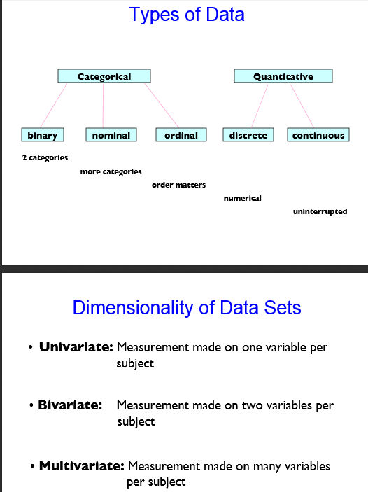

### Load libraries.

```{r}
library(xlsx)
library(mi)
library(ggplot2)
library(modeest)
library(corrplot)
```

### Read excel file

```{r}
datasetM <- read.xlsx("/srv/shiny-server/SemesterProject/Data/DataSet_01.xlsx", sheetIndex = 1, endRow=277)
```

### Meaning of variables

Post.ID - ID of a Facebook post

User Engagement - Number of ((Likes + Comments) diveded by Total Reach) multiplied by 100 000 -> "Besuchererfahrung" (e.g Website)

Acquaintance - User NW *	%Match  -> "Bekanntschaft" (Beziehung bestimmte Sender und Gemeinschaft)
 <https://www.academia.edu/2758533/Personal_acquaintance_measure_distinguishing_among_friends_and_good_and_bad_customers>
 
Experience - "Konsumenten-Erfahrung" (Neues Kunde vs. sehr lang) (1 sehr viel; 0 keine Erfah.)

Likes - ... of Facebook post

Comments - 

Fanpage Reach -

Earned Reach - The "real" stuff that comes automatically from non-facebook. Cross-sharing. 

Total Reach - Sum of Fanpage + Earned Reach

User NW - 

%-Match (X-Match) - 

Duration - 

Gender - think about it :) [0 for female and 1 for male]


<http://stackoverflow.com/questions/12868581/list-all-column-except-for-one-in-r>

```{r}
head(datasetM)

# print without 3 last cols
summary(datasetM[, !names(datasetM) %in% c("Experience", "Gender", "Duration")])
```

```{r, eval=FALSE}
#Mode
mlv(datasetM$User.Engage, method = "mfv")
```


### What type of variables we have ?



**Documentation of `mi` library says**:

**binary** :  	variables that contain two values

**positive-continuous** : variables that contain more than 5 postive values, NOT including 0s

**nonnegative** :  	variables that contain more than 5 postive values, including 0s.

**continuous** : 	variables that are not belong to any of the above types


<https://www.wiwiweb.de/statistik/grundbegriff/merkmale/stetige.html>

```{r}
# mi.info(datasetM) ## larger output
mdf <- missing_data.frame(datasetM)
show(mdf)
# cbind(type = typecast(datasetM)) # the author has delete functionality in the new version. 

```

### How many cases of each variable do we have ? 

```{r}
table(datasetM$Gender)

table(datasetM$Duration)
```

### Some correlations ?

```{r}
# http://cran.r-project.org/web/packages/corrplot/vignettes/corrplot-intro.html
without4 <- datasetM[, !names(datasetM) %in% c("Post.ID", "Experience", "Gender", "Duration")]
corrplot(cor(without4), order = "hclust", type = "lower", method = "number")
```


### Histograms ?

```{r}
m <- ggplot(datasetM, aes(x=Likes))
m <- m + geom_histogram(aes(y=..density..), colour="black", fill="white")
m <- m + geom_density()
# m <- m + coord_cartesian(xlim = c(0, 40), ylim=c(0,33)) + scale_x_continuous(breaks = seq(0, 40, 1)) 
# m <- m + scale_y_continuous(breaks = seq(0, 33, 1)) 
# m <- m + geom_vline(xintercept = mean(datasetM$Likes), size = 2, colour = "red")
m


dr1 <- ggplot(datasetM, aes(x=User.Engage))
dr1 <- dr1 + geom_histogram(aes(y=..density..), colour="black", fill="white")
dr1 <- dr1 + geom_density()
# dr1 <- dr1 + coord_cartesian(xlidr1 = c(0, 40), ylidr1=c(0,33)) + scale_x_continuous(breaks = seq(0, 40, 1)) 
# dr1 <- dr1 + scale_y_continuous(breaks = seq(0, 33, 1))
# dr1 <- dr1 + geodr1_vline(xintercept = dr1ean(datasetM$Likes), size = 2, colour = "red")
dr1

dr3 <- ggplot(datasetM, aes(x=Earned.Reach))
dr3 <- dr3 + geom_histogram(aes(y=..density..), colour="black", fill="white")
dr3 <- dr3 + geom_density()
# dr3 <- dr3 + coord_cartesian(xlidr3 = c(0, 40), ylidr3=c(0,33)) + scale_x_continuous(breaks = seq(0, 40, 1)) 
# dr3 <- dr3 + scale_y_continuous(breaks = seq(0, 33, 1))
# dr3 <- dr3 + geodr3_vline(xintercept = dr3ean(datasetM$Likes), size = 2, colour = "red")
dr3

```

```{r}

# Log-normal ?

dr2 <- ggplot(datasetM, aes(x=Comments))
dr2 <- dr2 + geom_histogram(aes(y=..density..), colour="black", fill="white")
dr2 <- dr2 + geom_density()
# dr2 <- dr2 + coord_cartesian(xlidr2 = c(0, 40), ylidr2=c(0,33)) + scale_x_continuous(breaks = seq(0, 40, 1)) 
# dr2 <- dr2 + scale_y_continuous(breaks = seq(0, 33, 1))
# dr2 <- dr2 + geodr2_vline(xintercept = dr2ean(datasetM$Likes), size = 2, colour = "red")
dr2
```


```{r}
po1 <- ggplot(datasetM, aes(x=X.Match))
po1 <- po1 + geom_histogram(aes(y=..density..), colour="black", fill="white")
po1 <- po1 + geom_density()
# po1 <- po1 + coord_cartesian(xlipo1 = c(0, 40), ylipo1=c(0,33)) + scale_x_continuous(breaks = seq(0, 40, 1)) 
# po1 <- po1 + scale_y_continuous(breaks = seq(0, 33, 1))
# po1 <- po1 + geopo1_vline(xintercept = po1ean(datasetM$Likes), size = 2, colour = "red")
po1
```


```{r}
# Log-normal ? 
m <- ggplot(datasetM, aes(x=Acquaintance))
m <- m + geom_histogram(aes(y=..density..), colour="black", fill="white")
m <- m + geom_density()
# m <- m + coord_cartesian(xlim = c(0, 40), ylim=c(0,33)) + scale_x_continuous(breaks = seq(0, 40, 1)) 
# m <- m + scale_y_continuous(breaks = seq(0, 33, 1))
# m <- m + geom_vline(xintercept = mean(datasetM$Likes), size = 2, colour = "red")
m
```


```{r}
# Binomial ?
m <- ggplot(datasetM, aes(x=Total.Reach))
m <- m + geom_histogram(aes(y=..density..), colour="black", fill="white") + geom_density()
# m <- m + coord_cartesian(xlim = c(0, 40), ylim=c(0,33)) + scale_x_continuous(breaks = seq(0, 40, 1)) 
# m <- m + scale_y_continuous(breaks = seq(0, 33, 1))
# m <- m + geom_vline(xintercept = mean(datasetM$Likes), size = 2, colour = "red")
m
```


```{r}
# 'Comments' histogram ?

w <- ggplot(datasetM, aes(x=Comments))
w <- w + geom_histogram(binwidth = 0.5)
w <- w + coord_cartesian(xlim = c(0, 40), ylim=c(0,50)) + scale_x_continuous(breaks = seq(0, 40, 1))
w <- w + scale_y_continuous(breaks = seq(0, 50, 1))
w <- w + geom_vline(xintercept = mean(datasetM$Comments), size = 2, colour = "red")
w
```

### Relationship between Likes and Comments

Thanks: <http://elkhartgroup.com/tutorials/modelsinr.html>

```{r}
relLC <- lm(Likes ~ Comments, data=datasetM)
relLC

relLC2 <- lm(Comments ~ Total.Reach, data=datasetM)
relLC2


likesComm <- ggplot(datasetM, aes(x=Likes, y=Comments))
likesComm <- likesComm + stat_smooth() + geom_point()
likesComm <- likesComm + geom_abline(intercept = coef(relLC)[1], slope = coef(relLC)[2])
likesComm

# With Gender groupings
likesComm2 <- ggplot(datasetM, aes(x=Likes, y=Comments, color = factor(Gender)))
likesComm2 <- likesComm2 + geom_point() + stat_smooth(method = "lm")
likesComm2

likesComm3 <- ggplot(datasetM, aes(x=Likes, y=Earned.Reach))
likesComm3 <- likesComm3 + geom_point() + stat_smooth(method = "lm")
likesComm3

```

Thanks: <http://www.ling.upenn.edu/~joseff/rstudy/summer2010_ggplot2_intro.html>

<http://www.unomaha.edu/mahbubulmajumder/data-science/fall-2014/lectures/05-data-visualization/05-data-visualization.html>

```{r}
likesComm3 <- ggplot(datasetM, aes(x=Likes, y=Comments, color = factor(Gender)))
likesComm3 <- likesComm3 + geom_point() + stat_smooth(method = "lm")
likesComm3 <- likesComm3 + facet_grid(~Duration) # Gender~Duration might be better too
likesComm3
```

### Relationship between Fan page and Earned Reach


```{r}
# With Gender groupings
fanEarned <- ggplot(datasetM, aes(x=Fanpage.Reach, y=Earned.Reach, color = factor(Gender)))
fanEarned <- fanEarned + geom_point() + stat_smooth(method = "lm")
fanEarned
```


### Probability distributions


<https://en.wikipedia.org/wiki/List_of_probability_distributions>
<https://de.wikipedia.org/wiki/Liste_univariater_Wahrscheinlichkeitsverteilungen>
<http://cran.r-project.org/web/views/Distributions.html>
<http://digitheadslabnotebook.blogspot.de/2011/02/using-r-for-introductory-statistics.html>

Behind VPN - will not work. Don't even try.
<http://shiny.b40.cz/SemesterProject/shiny/SSS/>


