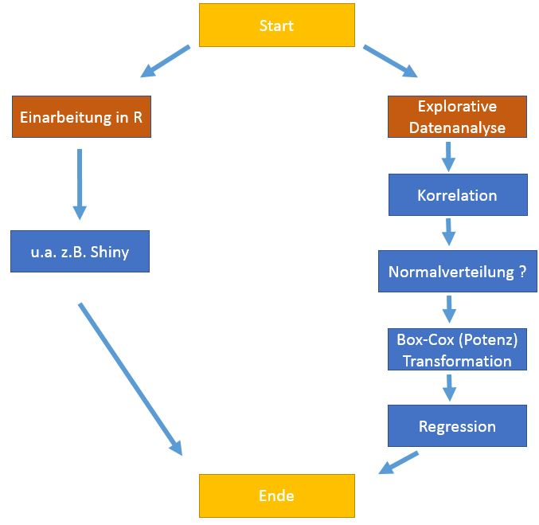

## Agenda | 23 Folien | 20 Minuten | 4 Teilnehmer

1. Einführung in das Projekt    
2. Einführung ins `R`           
3. Explorative Datenanalyse
    + Korrelation & Historgramm
    + Normalverteilung (+ QQ-Plot)
    + Potenz (Box-Cox) Transformation 
    + Lineare Regression (OLS)
4. Interaktive Applikation mit `Shiny Framework` 
5. Zusammenfassung 

## Einführung in das Projekt

- **Ziel**:
    + Mithilfe von `R` Modellierung einer Beziehungen zwischen 2 Variablen 
        + Quantifizierung ihres Zusammenhangs
        + Konzentration auf die Erstellung eines **Lineares Modells**: $y=\beta_0 +\beta_1 x + e$
                                                                  
- **Daten**:
     

## Geschichte von R

- `R` ist eine Implementierung von `S` (*John Chambers et al.* @ Bell Labs 1976)

>- Pionier von *Ross Ihaka* and *Robert Gentleman* in **1991**
    + seit 1995 unter **GNU GPL**

>- Erst aber 2000 **stabil** und aktiv von **R Core Group** weiter entwickelt

>- Heute >2 Implementierungen: `S-PLUS` (commerziel) und **`R`** (GNU project) 
    + mit vielen weiteren Distributionen: 
        + `Revolution R Open` (ab 1Q. 2015 Microsoft)
        + `Oracle R Enterprise`
    
## R

- Geschrieben in **`C`** (35%) & **`Fortan`** (24%) & **`R`** (38%)

>- Objekte & **Daten** werden explizit im **RAM** gespeichert 
    + 100 Millionen x 5 Matrix ~> 4 GB RAM [5]
    
>- Sehr **schlank** 
    + Funktionalität in modularen Pakete aufgeteilt (z.B. von **CRAN** oder **GitHub**)

>- Heute populär bei **Forschern für Data Mining** Zwecke, statt *Stata* & *SPSS* usw. 
    + vgl. TIOBE Index [15]

## Explorative Datenanalyse (EDA)

"*Sie untersucht und begutachtet Daten, von denen nur ein geringes Wissen über deren Zusammenhänge vorliegt.*" [10]


```{r, message=FALSE, cache=TRUE, echo=FALSE}
library(xlsx)
library(dplyr)
dataset.S <- read.xlsx("../Data/DataSet_01.xlsx", sheetIndex = 1, endRow=277)
dataset.P <- read.xlsx("../Data/DataSet_Product.xlsx", sheetIndex = 1, endRow=302)
datasetS.kleiner <- dataset.S[, !names(dataset.S) %in% c("Gender", "Duration", "Experience", "Post.ID")]

joinedDataSets <- full_join(dataset.S, dataset.P)
joinedDataSets.without <- joinedDataSets[, !names(joinedDataSets) %in% c("Duration", "Post.ID", "Earned.Reach", "Fanpage.Reach", "User.NW", "X.Match")]

```

## Korrelation

- Beschreibt eine Beziehung zwischen ein oder mehreren Merkmalen
    + muss aber **keine** Ursache-Wirkung-Beziehung (Kausalität) bestehen

- Korrelation als Maß des Zusammenhangs
    + **-1**   = "Starker negativer Zusammenhang"
    + **0**    = "Kein Zusammenhang"
    + **1**    = "Starker possitiver Zusammenhang"

Variable/Datensatze | Produkt  | Service  | Joined
--------- | ---------- | ------------- | -----------
User Engagement <-> Acquaintance  | 0.70 | 0.63 | 0.54

## Streudiagramm

*"Graphische Darstellung von beobachteter Wertepaaren zweier statistischer Merkmale*" [10]

>- Die Wertepaare werden in ein kartesischer Koordinatensystem eingetragen  
    + ergibt eine Punktwolke

>- Das Muster gibt Infos über die Abhängigkeit der beiden Merkmale

## Diagramm von beiden Merkmalen (Service)

```{r, message=FALSE, cache=TRUE, echo=FALSE, fig.align='center'}
plot(datasetS.kleiner$Acquaintance, datasetS.kleiner$User.Engage, xlab = "Acquaintance", ylab = "User Engagement")
```

## Histogramm

"*Graphische Darstellung der Häufigkeitsverteilung metrisch skalierter Merkmale*" [10]

- Anwendung
    + wenn man z.B. den Verlauf der Häufigkeitsverteilung sehen möchte
    + wenn man vermutet, dass mehrere Faktoren einen Prozess beeinflussen, und man diese nachweisen will ??????????

## Histogramm von User Engagement (Service)

```{r, message=FALSE, cache=TRUE, echo=FALSE, fig.align='center'}
library(ggplot2)

m1 <- ggplot(datasetS.kleiner, aes(x=User.Engage))
m1 <- m1 + geom_histogram(colour="black", fill="white") + xlab("User Engagement")
m1
```

## Normalverteilung

- Bezeichnet eine wichtige Form der Wahrscheinlichkeistverteilung
    + *Median* und *Mittelwert* sind identisch
    + Aussehen und Eigenschaften werden von Erwartungswert und Varianz bestimmt [20, 21]
    + Benuzt z.B. bei der annäherten Beschreibung von Körpergröße, Einkommen usw. 
  
<math xmlns="http://www.w3.org/1998/Math/MathML">
<mrow class="MJX-TeXAtom-ORD">
  <mstyle displaystyle="true" scriptlevel="0">
    <mi>f</mi>
    <mo stretchy="false">(</mo>
    <mi>x</mi>
    <mo>;</mo>
    <mi>μ<!-- μ --></mi>
    <mo>,</mo>
    <msup>
      <mi>σ<!-- σ --></mi>
      <mn>2</mn>
    </msup>
    <mo stretchy="false">)</mo>
    <mo>=</mo>
    <mfrac>
      <mn>1</mn>
      <mrow>
        <mi>σ<!-- σ --></mi>
        <msqrt>
          <mn>2</mn>
          <mi>π<!-- π --></mi>
        </msqrt>
      </mrow>
    </mfrac>
    <msup>
      <mi>e</mi>
      <mrow class="MJX-TeXAtom-ORD">
        <mo>−<!-- − --></mo>
        <mfrac>
          <mn>1</mn>
          <mn>2</mn>
        </mfrac>
        <msup>
          <mrow>
            <mo>(</mo>
            <mfrac>
              <mrow>
                <mi>x</mi>
                <mo>−<!-- − --></mo>
                <mi>μ<!-- μ --></mi>
              </mrow>
              <mi>σ<!-- σ --></mi>
            </mfrac>
            <mo>)</mo>
          </mrow>
          <mn>2</mn>
        </msup>
      </mrow>
    </msup>
  </mstyle>
</mrow>
</math>


## Normalverteilung von User Engagement (Service)

```{r, message=FALSE, cache=TRUE, echo=FALSE, fig.align='center'}
library(ggplot2)

m <- ggplot(datasetS.kleiner, aes(x=User.Engage))
m <- m + geom_histogram(aes(y=..density..), colour="black", fill="white")
m <- m + geom_density() + xlab("User Engagement")
m
```

## QQ-Plot

"*Ein graphischer Weg zur Beurteilung, ob Messwerte einer Verteilung Normalverteilt sind.*" [22]

- Deskriptive Überprüfung auf die Normalverteilung 
    + anderen wären verschiedenen Tests, wie z.B. `Chi-Quadrat-Test`

- Wenn Punkte annähernd auf einer Geraden liegen, sind die Daten näherungsweise normalverteilt, ansonsten nicht.

## QQ-Plot von User Engagement

```{r, message=FALSE, cache=TRUE, echo=FALSE, fig.align='center'}
library(car)

qqnorm(datasetS.kleiner$User.Engage)
qqline(datasetS.kleiner$User.Engage)
```

## Box-Cox (Potenz) Transformation

<math xmlns="http://www.w3.org/1998/Math/MathML">
<mrow class="MJX-TeXAtom-ORD">
  <mstyle displaystyle="true" scriptlevel="0">
    <msubsup>
      <mi>y</mi>
      <mrow class="MJX-TeXAtom-ORD">
        <mi>i</mi>
      </mrow>
      <mrow class="MJX-TeXAtom-ORD">
        <mrow class="MJX-TeXAtom-ORD">
          <mo stretchy="false">(</mo>
          <mi>λ<!-- λ --></mi>
          <mo stretchy="false">)</mo>
        </mrow>
      </mrow>
    </msubsup>
    <mo>=</mo>
    <mrow class="MJX-TeXAtom-ORD">
      <mrow>
        <mo>{</mo>
        <mtable columnalign="left left" rowspacing="1em 0.2em" columnspacing="1em" displaystyle="false">
          <mtr>
            <mtd>
              <mrow class="MJX-TeXAtom-ORD">
                <mstyle displaystyle="true" scriptlevel="0">
                  <mfrac>
                    <mrow>
                      <msubsup>
                        <mi>y</mi>
                        <mrow class="MJX-TeXAtom-ORD">
                          <mi>i</mi>
                        </mrow>
                        <mrow class="MJX-TeXAtom-ORD">
                          <mi>λ<!-- λ --></mi>
                        </mrow>
                      </msubsup>
                      <mo>−<!-- − --></mo>
                      <mn>1</mn>
                    </mrow>
                    <mi>λ<!-- λ --></mi>
                  </mfrac>
                </mstyle>
              </mrow>
            </mtd>
            <mtd>
              <mrow class="MJX-TeXAtom-ORD">
                <mtext>if&nbsp;</mtext>
              </mrow>
              <mi>λ<!-- λ --></mi>
              <mo>><!-- ≠ --></mo>
              <mn>0</mn>
              <mo>,</mo>
            </mtd>
          </mtr>
          <mtr>
            <mtd>
              <mi>ln</mi>
              <mrow class="MJX-TeXAtom-ORD">
                <mo stretchy="false">(</mo>
                <msub>
                  <mi>y</mi>
                  <mrow class="MJX-TeXAtom-ORD">
                    <mi>i</mi>
                  </mrow>
                </msub>
                <mo stretchy="false">)</mo>
              </mrow>
            </mtd>
            <mtd>
              <mrow class="MJX-TeXAtom-ORD">
                <mtext>if&nbsp;</mtext>
              </mrow>
              <mi>λ<!-- λ --></mi>
              <mo>=</mo>
              <mn>0</mn>
              <mo>,</mo>
            </mtd>
          </mtr>
        </mtable>
        <mo fence="true" stretchy="true"></mo>
      </mrow>
    </mrow>
  </mstyle>
</mrow>
</math>

- Mehrere Anwendungen, u.a. bei der Transformation auf Normalverteilung

- **Frage**: Finde *Lambda* welches zu der größten Korrelation führt

- *Lambdas*:

Variable | Produkt  | Service  | Joined
--------- | ---------- | ------------- | -----------
User Engagement | 0.497 | 0.0005 | 0.490
Acquaintance  | 0.895 | 0.139 | 0.445

## Vor und Nach 

```{r, message=FALSE, out.width="830", out.heigh="550", cache=TRUE, echo=FALSE, fig.align='center'}

par(mfrow=c(2,3))
plot(dataset.P$Acquaintance, dataset.P$User.Engage, xlab = "Acquaintance", ylab = "User Engagement", main = "Product")
plot(datasetS.kleiner$Acquaintance, datasetS.kleiner$User.Engage, xlab = "Acquaintance", ylab = "User Engagement", main = "Service")
plot(joinedDataSets.without$Acquaintance, joinedDataSets.without$User.Engage, xlab = "Acquaintance", ylab = "User Engagement", main = "Joined")


plot((dataset.P$Acquaintance^0.5-1)/0.5, (dataset.P$User.Engage^0.5-1)/0.5, xlab = "Acquaintance", ylab = "User Engagement")
plot((datasetS.kleiner$Acquaintance^0.5-1)/0.5, (datasetS.kleiner$User.Engage^0.5-1)/0.5, xlab = "Acquaintance", ylab = "User Engagement")
plot((joinedDataSets.without$Acquaintance^0.5-1)/0.5, (joinedDataSets.without$User.Engage^0.5-1)/0.5, xlab = "Acquaintance", ylab = "User Engagement")

```

## Abschätzung der linearen Parameter

> Sei $y=\;\beta_0+\beta_1\ast x+\xi$ und $\xi$ sei $\\N(\mu,\;\sigma^2I)$ verteilt. 
> 
> Dann ist ein 100(1-$\alpha$) % Konfidenzgebiet fur $\beta$ gegeben durch
> $(\beta-\widehat\beta)'\;z\;'z\;(\beta-\widehat\beta)\;\leq2\;s^2\;F_{2,\;n-2}\;(\alpha)$ wo 
>
> <math xmlns="http://www.w3.org/1998/Math/MathML"><mrow class="MJX-TeXAtom-ORD"><mstyle scriptlevel="0" displaystyle="true"><msup><mi>s</mi><mn>2</mn></msup><mo>=</mo><mfrac><mrow><msup><mi>&epsilon;</mi><mi mathvariant="normal" class="MJX-variant">&prime;</mi></msup><mi>&epsilon;</mi></mrow><mrow><mi>n</mi><mo>&minus;</mo><mi>p</mi></mrow></mfrac></mstyle></mrow></math>
>
> $\\F_{2,\;n-2}\;=\;$ F-Verteilung mit 2 und n-2 Freiheitsgraden
> 

## Ellipse "Product"

- Text

```{r, message=FALSE, cache=TRUE, echo=FALSE, fig.align='center'}
library(car)

xAQ2 <- (dataset.P$Acquaintance^0.5-1)/0.5
yAQ2 <- (dataset.P$User.Engage^0.5-1)/0.5

fit <- lm(yAQ2 ~ xAQ2)

confidenceEllipse(fit, levels = 0.95)
```

## 95% Konfidenzintervall des Lineares Modells

```{r, message=FALSE, cache=TRUE, echo=FALSE, fig.align='center'}
# https://stackoverflow.com/questions/21810664/how-to-use-the-predict-function-for-creating-the-confidence-bands-in-r

source("http://sites.stat.psu.edu/~dhunter/R/confidence.band.r")

confidence.band(fit, xlab = "Acquaintance", ylab = "User Engagement")
```

## Regression von transformiertem "Product"

```{r, message=FALSE, cache=TRUE, echo=FALSE, fig.align='center'}
library(car)

xAQ2 <- (dataset.P$Acquaintance^0.5-1)/0.5
yAQ2 <- (dataset.P$User.Engage^0.5-1)/0.5

scatterplot(xAQ2, yAQ2, xlab = "Acquaintance", ylab = "User Engagement", ellipse=TRUE, smoother= FALSE, levels= c(.5, .95), col=c(palette()[3], palette()[2], palette()[1]))
```


## Shiny Framework

- R framework für interaktive Web Anwendungen

- Jede `Shiny App` besteht aus: 
    + **UI.R** ~> steuert das **Layout und Aussehen**
    + **SERVER.R** ~> enthält Befehle z.B. zur **Berechnungen, Grafiken** usw.

- Basiert auf Twitter's `Bootstrap` Web framework

- **Ziel**: Wie arbeitet man mit `Shiny` ?

- <span style="color: red">Live DEMO</span>: <http://shiny.b40.cz/SemesterProject/shiny>

## Fazit



## Quellen
1. https://github.com/rdpeng/courses/blob/master/02_RProgramming/OverviewHistoryR/index.md
4. http://www.stat.yale.edu/~mjk56/temp/bigmemory-vignette.pdf
5. https://www-conf.slac.stanford.edu/xldb2015/Talks2015/9_Tues_Chambers-XLDBConference.pdf
6. https://github.com/rstudio/webinars/blob/master/2015-05/How-to-start-Shiny-1/01-How-to-start.pdf
8. http://de.wikipedia.org/wiki/ {Quantile-Quantile-Plot, Explorative_Datenanalyse, Streudiagramm, Histogramm}
10. http://www.tiobe.com/index.php/content/paperinfo/tpci/index.html
11. http://de.statista.com/statistik/lexikon/definition/95/normalverteilung/
13. http://onlinestatbook.com/2/transformations/box-cox.html
14. https://stat.ethz.ch/education/semesters/WS_2006_07/asr/Stat.pdf
http://people.duke.edu/~rnau/testing.htm
http://www.ime.usp.br/~abe/lista/pdfm9cJKUmFZp.pdf
http://citeseerx.ist.psu.edu/viewdoc/download?doi=10.1.1.469.7176&rep=rep1&type=pdf
http://de.wikipedia.org/wiki/Homoskedastizit%C3%A4t_und_Heteroskedastizit%C3%A4t
http://blog.minitab.com/blog/statistics-and-quality-data-analysis/dont-be-a-victim-of-statistical-hippopotomonstrosesquipedaliophobia


20. http://flexikon.doccheck.com/de/Normalverteilung
21. http://matheguru.com/stochastik/31-normalverteilung.html
22. http://psymet03.sowi.uni-mainz.de/meinharg/Lehre/WS2008_2009/StatistikI/UE_2008_12_11.pdf

## Wir danken für die Aufmerksamkeit !

### Folgenden Werkzeuge wurden benutzt:
+ Presentation mit [R Markdown](http://rmarkdown.rstudio.com/) erstellt.
+ "Die" IDE - [RStudio](http://www.rstudio.com)
+ Web Applikations Framework für R - [Shiny @ RStudio](http://shiny.rstudio.com/)
+ <https://github.com/dmpe/SemesterProject>


