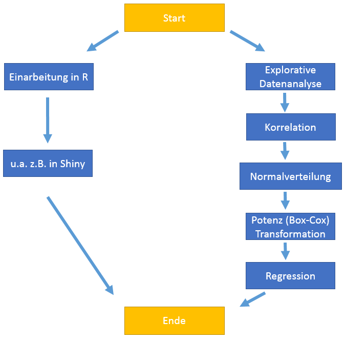

## Agenda | 24 Folien | 20 Minuten | 4 Teilnehmer

1. Einführung in das Projekt    
2. Einführung ins `R`           
3. Explorative Datenanalyse
    + EDA 
    + Korrelation (Streudiagramm)   
    + Historgramm (Normalverteilung, QQ-Plot)
    + Lineare Regression (OLS)
4. Interaktive Applikation mit `Shiny Framework` 
5. Ergebnisse/Zusammenfassung 

## Einführung in das Projekt

- **Ziel**:
    + Mithilfe `R` verschiedene Zusammenhänge in den Daten suchen & überprüfen
        + Konzentration auf Normalverteilung und Suche nach dem Linearem Model

>- **Daten**:
    + 2 Datensätze aus Marketing-Bereich: "Produkt" & "Service"
   
>- **3 Mermale**:
    - Bekanntschaft/Kenntniss (Acquaintance)
    - User Engagement
    - Erfahrung (Experience)

## Geschichte von R

- `R` ist eine Implementierung von `S` (*John Chambers et al.* @ Bell Labs 1976)

>- Pionier von *Ross Ihaka* and *Robert Gentleman* in **1991**, seit 1995 unter **GNU General Public License**

>- Erst aber 2000 **stabil** und aktiv von **R Core Group** weiter entwickelt

>- Heute >2 Implementierungen: `S-PLUS` (commerziel) und **`R`** (GNU project) 
    + mit vielen weiteren Distributionen: `Revolution R Open`, `Oracle R Enterprise`

## R

- Geschrieben in **`C`** (35%) & **`Fortan`** (24%) & **`R`** (38%)

>- Sehr **schlank** -> Funktionalität in modularen Pakete aufgeteilt (**CRAN**/Bioconductor/GitHub)

>- Objekte, **Daten** etc. sind explizit in **RAM** gespeichert (100 Mil. x 5 Matrix ~ 4 GB RAM [5])

>- Funktionalität basiert auf Basis der **Nachfrage** und der **Nutzerbeiträge**

>- Heute populär bei **Forschern für Data Mining** Zwecke, statt *Excel, Stata* usw. (z.B. TIOBE Index [15]). 

## Explorative Datenanalyse (EDA)

"*EDA untersucht und begutachtet Daten, von denen nur ein geringes Wissen über deren Zusammenhänge vorliegt.*" [10]


```{r, message=FALSE, cache=TRUE, echo=FALSE}
library(xlsx)

dataset.S <- read.xlsx("../Data/DataSet_01.xlsx", sheetIndex = 1, endRow=277)
# dataset.P <- read.xlsx("../Data/DataSet_Product.xlsx", sheetIndex = 1, endRow=302)
```

## Korrelation

- Beschreibt eine Beziehung zwischen ein oder mehreren Merkmalen
    + gibt aber **keine** Ursache-Wirkung-Beziehung (keine Kausalität)

>- Korrelation als Maß des Zusammenhangs
    + -1   = "Starker negativer Zusammenhang"
    + 0    = "Kein Zusammenhang"
    + 1    = "Starker possitiver Zusammenhang"

## Korrelations Plot

```{r, message=FALSE, out.width="640px", out.height="530px", cache=TRUE, echo=FALSE, fig.align='center'}
library(corrplot)

datasetS.kleiner <- dataset.S[, !names(dataset.S) %in% c("Gender", "Duration", "Experience", "Post.ID")]
datasetS.kleiner.cor <- cor(datasetS.kleiner)
corrplot(datasetS.kleiner.cor, order = "hclust", type="lower", method="number")
```

## Streudiagramm  (Scatter Plot)

- *"Ist die graphische Darstellung von beobachteter Wertepaaren zweier statistischer Merkmale*" [10]

>- Die Wertepaare werden in ein kartesischer Koordinatensystem eingetragen -> ergibt Punktwolke

>- Das Muster gibt Infos über die Abhängigkeit der beiden Merkmale

## Diagramm von Acquaintance & User Engage.

```{r, message=FALSE, out.width="650px", cache=TRUE, echo=FALSE, fig.align='center'}
library(car)

print(round(cor(datasetS.kleiner$Acquaintance, datasetS.kleiner$User.Engage), 4))

scatterplot(datasetS.kleiner$Acquaintance, datasetS.kleiner$User.Engage, xlab = "Acquaintance", ylab = "User Engagement")
```

## Histogramm

"*Ist eine graphische Darstellung der Häufigkeitsverteilung metrisch skalierter Merkmale.*" [10]

**Anwendung**

- u.a. in der beschreibende Statistik
    + wenn man den Verlauf der Häufigkeitsverteilung sehen möchte
    + wenn man vermutet, dass mehrere Faktoren einen Prozess beeinflussen, und man diese nachweisen will

## Histogramm von User Engagement

```{r, message=FALSE, out.width="650px", out.heigh="450px", cache=TRUE, echo=FALSE, fig.align='center'}
library(ggplot2)

m1 <- ggplot(datasetS.kleiner, aes(x=User.Engage))
m1 <- m1 + geom_histogram(colour="black", fill="white")
m1
```

## Normalverteilung

- Die Normalverteilung (Glockenkurve oder Gauß-Kurve) bezeichnet eine wichtige Form der Wahrscheinlichkeistverteilung.
  + Kurvenverlauf  ist symmetrisch.
  + Median und Mittelwert identisch.
  + Aussehen und Eigenschaft wird von Zwei Parameter bestimmt
    + Erwartungswert und Varianz. [20, 21]
    


## Normalverteilung von User Engagement

```{r, message=FALSE, cache=TRUE, echo=FALSE, out.width="650px", out.heigh="430px", fig.align='center'}
library(ggplot2)

m <- ggplot(datasetS.kleiner, aes(x=User.Engage))
m <- m + geom_histogram(aes(y=..density..), colour="black", fill="white")
m <- m + geom_density()
m
```

## QQ-Plot

- Mit dem QQ-Plot kann man auf graphischem Wege beurteilen, ob Messwerte Realisierungen einer normalverteilten Zufallsvariablen sind.
  + Wenn diese Punkte annähernd auf einer Geraden liegen, sind die Daten näherungsweise normalverteilt, ansonsten nicht. [22]

## QQ-Plot von User Engagement

```{r, message=FALSE, out.width="650px", out.heigh="450px", cache=TRUE, echo=FALSE, fig.align='center'}
library(car)

qqnorm(datasetS.kleiner$User.Engage)
qqline(datasetS.kleiner$User.Engage)
```

## Box-Cox (Potenz) Transformation


- Mehrere Anwendungen, aber u.a. bei der Transformation auf Normalverteilung

- **Frage**: Finde *Lambda* welches zu der grosste Korrelation fuhrt. 

>- Gemeinsamen Datensatz
    + 0.49 bei User Engagement
    + 0.44 bei Acquaintance

>- "Nice to have" fur das Lineare Modell, da sonst haben wir problem mit dem Modell.

## Lin. Reg.: Methode der kleinsten Quadrate (OLS)


## Ellipse


## Shiny Framework

- R framework für interaktive Web Anwendungen

- Jede Shiny App. besteht aus: 
    + **UI.R** -> steuert das **Layout und Aussehen**.
    + **SERVER.R** -> enthält Befehle z.B. zur **Berechnungen, Grafiken** usw.

- Basiert auf Twitter's `Bootstrap` Web framework [17]

- **Ziel**: Wie arbeitet man mit `Shiny` ?

- <span style="color: red">Live DEMO</span>: <http://shiny.b40.cz/SemesterProject/shiny>

## Fazit



## Quellen
1. https://github.com/rdpeng/courses/blob/master/02_RProgramming/OverviewHistoryR/index.md
2. http://en.wikipedia.org/wiki/R_%28programming_language%29
3. http://www.rstudio.com/wp-content/uploads/2015/03/rmarkdown-reference.pdf
4. http://www.stat.yale.edu/~mjk56/temp/bigmemory-vignette.pdf
5. https://www-conf.slac.stanford.edu/xldb2015/Talks2015/9_Tues_Chambers-XLDBConference.pdf
6. https://github.com/rstudio/webinars/blob/master/2015-05/How-to-start-Shiny-1/01-How-to-start.pdf
8. http://de.wikipedia.org/wiki/ {Quantile-Quantile-Plot, Explorative_Datenanalyse, Streudiagramm, Histogramm}
9. http://en.wikipedia.org/wiki/Q%E2%80%93Q_plot
10. http://www.tiobe.com/index.php/content/paperinfo/tpci/index.html
11. http://de.statista.com/statistik/lexikon/definition/95/normalverteilung/
12. http://getbootstrap.com/
13. http://onlinestatbook.com/2/transformations/box-cox.html
14. https://stat.ethz.ch/education/semesters/WS_2006_07/asr/Stat.pdf
http://people.duke.edu/~rnau/testing.htm
http://www.ime.usp.br/~abe/lista/pdfm9cJKUmFZp.pdf
http://citeseerx.ist.psu.edu/viewdoc/download?doi=10.1.1.469.7176&rep=rep1&type=pdf
http://de.wikipedia.org/wiki/Homoskedastizit%C3%A4t_und_Heteroskedastizit%C3%A4t
http://blog.minitab.com/blog/statistics-and-quality-data-analysis/dont-be-a-victim-of-statistical-hippopotomonstrosesquipedaliophobia


20. http://flexikon.doccheck.com/de/Normalverteilung
21. http://matheguru.com/stochastik/31-normalverteilung.html
22. http://psymet03.sowi.uni-mainz.de/meinharg/Lehre/WS2008_2009/StatistikI/UE_2008_12_11.pdf

## Wir danken für die Aufmerksamkeit !

### Folgenden Werkzeuge wurden benutzt:
+ Presentation mit [R Markdown](http://rmarkdown.rstudio.com/) erstellt.
+ Die Beste IDE - [RStudio](http://www.rstudio.com)
+ Web Applikations Framework für R - [Shiny @ RStudio](http://shiny.rstudio.com/)
+ <https://github.com/dmpe/SemesterProject>


